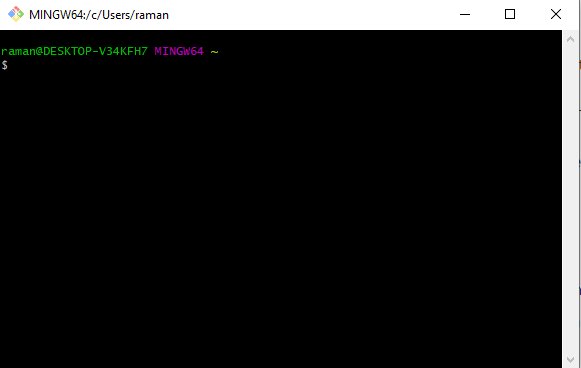
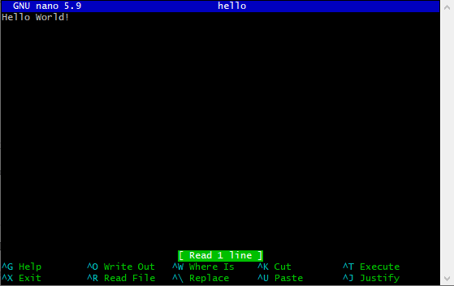

# Unit 2: Touching the Terminal

## Welcome to Unit 2 ✌️

In this unit, we will be going over how to use the terminal, or you may know it as the command line. Let’s get started!

## Unit 2 Lecture Video

<iframe width="560" height="315" src="https://youtube.com/embed/KAKWE1xj_II" title="YouTube video player" frameborder="0" allow="accelerometer; autoplay; clipboard-write; encrypted-media; gyroscope; picture-in-picture" allowfullscreen="true"></iframe>

## Terminal

The Terminal is a text-based interface every computer has to allow the user to write commands and tell the computer what to do. Depending on your operating system, there are different ways of accessing the terminal. 

### Accessing the Terminal

- **MacOS**
    
    Open spotlight search. You can do this by hitting ⌘ + Space. You can also open spotlight search by clicking the search icon in the Menu bar at the top. Type in “terminal” and hit Enter. This should open up a terminal on your computer!
    
- **Windows**
    
    Unfortunately the Windows Terminal has different tools from those of MacOS or Linux. To create a similar environment, we will be using Git Bash as our terminal. Git Bash provides a BASH emulation and lets you use similar commands as in a Mac or Linux Terminal. 
    
    To install Git Bash, you will need to install Git, which can be done [here](https://git-scm.com/download/win). Once installed, hit the windows button, or open the start menu. Search for “Git Bash” and if you hit Enter, it should open up the shell. 
    
- **Linux**
    
    You can open terminal by hitting [ctrl + alt + T], or you can search it, by clicking the “Dash” icon, and typing in “terminal”. Open up the terminal application, and it should show up.
    

Voila! Your terminal should look something like this, prompting you to type. 



## Commands

A command is a special keyword you can use in your terminal to specify an action. When you opened the terminal on your computer, you are prompted to type in commands. These commands can print out information for you, or help control your computer. 

| Command | Function | Examples |
| --- | --- | --- |
| ls | Short for ‘list’, lists the files in the current directory. | `ls`, `ls Documents` |
| pwd | Prints the current working directory. This is also usually shown at the prompt line. | `pwd` |
| cd | Known as change directory, this command changes the current directory in the file. | `cd Documents`, `cd ..` (If you don’t know what `..` is, google it!) |
| mkdir | Create a new directory.  | `mkdir NewFolder` |
| rm | Removes files or directories. | `rm File` , `rm -r Folder` |
| touch | Creates a file. | `touch hello.txt` |
| cat | Concatenate. Prints files to the output stream. | `cat hello.txt` |
| mv | Moves or renames a file | `mv file.txt new_name.txt` |
| cp | Copies a file | `cp file.txt copied_file.txt` |
| exit | Exit your terminal instance | `exit` |

There are so many more commands you can use, and you can find some of them with `help`, or often times doing your own research. For more information on each command, often times you look at the [Linux man pages](https://man7.org/linux/man-pages/).

### Arguments

An argument is passed into an argument to specify or provide more information to the command for the computer. For example, `cd Documents`, would change the current directory into the Documents folder.

### Options

Options are flags or switches, that also give more information to the computer. However, unlike arguments, these are built-in and must match the syntax of the command. Usually, a flag might look like `ls -a` . Here, the `a` flag specifies to also list out hidden files.

If you don’t know a command, or are looking for help, all commands have an option flag `--help`. This will print out a description of the command, and list out other arguments and options you can use. 

## Text Editors

When typing commands in terminal, you might find yourself looking to make a quick change to a text file. Rather than opening up a text editor, you can edit these files in the terminal itself. Some of the most popular options are **Vim** and **Nano**.

### Vim


Vim is a lightweight text editor, you can use inside of your terminal. You will find that many programmers use this editor, known for its mouse-less interaction. However, it is a little complicated, so let’s get started.  
 
**Opening a File**  To open a file just type in `vim FILE_NAME` into your terminal.  This should open up the vim editor in your terminal. 

**Modes**

There are 2 main modes that you will be using in Vim — **command mode** and **insert mode**. When you first open up a file, you will be in command mode. You will notice that typing inside the text will not insert any characters. Instead, your keys are different commands that let you move your cursor, or change modes. You can check out this Vim [cheatsheet](https://vim.rtorr.com/) for all the possible commands.

The most important one will be hitting *i* (for “insert”), which will change to insert mode. In insert mode, you will be able to type as expected. If you want to leave this mode, just press Escape, and you’ll switch back to command mode. 

**Saving the File**

To save and exit the file, make sure you’re in command mode. Press : and you will be in last-line mode. In this mode, you can enter commands like `:w` to save or `:q` to exit. You can even combine these and type `:wq` to save and exit.

### Nano



Nano is another text editor built into your terminal. It is a simpler than Vim, because it doesn’t have any modes. 

**Opening a File**

To open a file in nano type in `nano FILE_NAME` into your terminal.  This should open up the nano editor in your terminal.

**Editing a File**

Once open, you can immediately start writing the file, but you will also notice at the bottom a list of basic command shortcuts to use with the nano editor. You can take a look at a [cheatsheet](https://www.nano-editor.org/dist/latest/cheatsheet.html) for all official commands for nano.

**Saving the File**

To save and exit the file, you will be using two commands. Ctrl + O, saves the file, and Ctrl + X, will exit the editor.  

## Bonus Lecture - Bash

<iframe width="560" height="315" src="https://youtube.com/embed/bwqw-CwC6hI" title="YouTube video player" frameborder="0" allow="accelerometer; autoplay; clipboard-write; encrypted-media; gyroscope; picture-in-picture" allowfullscreen></iframe>

<iframe width="560" height="315" src="https://youtube.com/embed/I4EWvMFj37g" title="YouTube video player" frameborder="0" allow="accelerometer; autoplay; clipboard-write; encrypted-media; gyroscope; picture-in-picture" allowfullscreen></iframe>


### .bashrc

In your root directory, type `ls -a` to find your `.bashrc` file. 
If you are on MacOS (post Catalina) you may have a `.zshrc` file instead. 

This file will run every time that you start a new terminal. Inside of it, you can add your own custom aliases, functions, and customize you prompt.

<aside>
💡 When you make changes to the `.bashrc` or `.zshrc`, those changes won’t take effect until open up a new Terminal window or run `source .bashrc` (`source .zshrc` on Mac)

</aside>

### Functions and Aliases

You can create your own custom functions and aliases to make life easier in the terminal. 

An “alias” is a word that gets replaced by another command. For example, `alias x='exit'`, means that `x` will be evaluated as `exit`.

Functions are a way for you to execute multiple lines of bash code. 

```bash
# This function will move me into the Code/ directory
# and then print out the contents of the directory.
dev() {
	cd ~/Documents/Code
	ls
}
```

You can learn more about functions [here](https://linuxize.com/post/bash-functions/). 

### Customizing Your Prompt

There are lots of things you can do with your prompt. It can print the current directory you’re in, show the time, display the git branch, and more. You can even add colors! This is done using special prompt characters.
*Note: the special characters may differ between `.bashrc` and `.zshrc`.*

In `.bashrc`, for example, `\d` will print the date, `\u` will print the current user, and **`\w`** will print the current user. You can find a list of commands in this [Bash Prompt Guide](https://ss64.com/bash/syntax-prompt.html).

For `.zshrc`, please refer to this [ZSH Prompt Guide](https://blog.devgenius.io/customize-the-macos-terminal-zsh-4cb387e4f447) and the [ZSH Prompt Documentation](https://zsh.sourceforge.io/Doc/Release/Prompt-Expansion.html#Prompt-Expansion).

---

## Assignment

This week, your assignment will be to create a specific file directory structure using terminal commands. Once completed, you will send a screenshot of your terminal with the commands you ran and their respective outputs.

1. Choose a folder you would like to do your projects in. In this case, I chose `/Users/name/Documents`
2. Create a directory called `Fellowship` and then create another directory inside called `Unit2`.
Your file structure should be something like: `/Users/name/Documents/Fellowship/Unit2`
3. Inside of Unit 2, create 2 files - one using vim, and one using nano.  
Call the first one `vim.txt` and the second one `nano.txt`.  

   a. In the first file, `nano.txt`, use nano to write:
    
    
    This file was created in Nano!
    
    FIRSTNAME 
   b. In the second file, `vim.txt`, use vim to write:
    
    
    This file was created in Vim!
    
    LASTNAME
    
4. From the Unit 2 directory, run these commands.
    
    ```bash
    pwd
    ls
    cat nano.txt
    cat vim.txt
    ```
    
5. Take a screenshot of your output. It should match the example below! Post your screenshot under [Unit 2 thread](https://ptb.discord.com/channels/772739905981644850/927468256070086696/930540634224345119) in the `#announcements`channel. 
    
    
    

### Deliverables

**Required Tasks**

- [ ]  Follow the directions above to set up your project directory. Take a screenshot and post it in the announcements thread.
- [ ]  Complete the [Quiz](https://forms.gle/1whc3n6FjNNoq5ye9)

**Optional** **Stretch Goals**

- [ ]  Head to [Vim Adventures](https://vim-adventures.com/) and try to beat the puzzles! What object comes out of the final chest?
- [ ]  Add some custom code to your .bashrc or .zshrc

### Due Date

Monday, January 17 by 11:59pm

### Submission

Send your screenshot in the Discord channel and complete [the quiz](https://forms.gle/huFVCdN48dcfty256) for this week.

<iframe src="https://docs.google.com/forms/d/e/1FAIpQLSdn3Mrv8_RShKjSLfD-th7L0LrNWVyXjtfEuQzz_EWMFhwGHQ/viewform?embedded=true" width="640" height="1056" frameborder="0" marginheight="0" marginwidth="0">Loading…</iframe>

## External Resources

- Commands
    - [MIT Terminus Game](http://web.mit.edu/mprat/Public/web/Terminus/Web/main.html)
    - [https://man7.org/linux/man-pages/](https://man7.org/linux/man-pages/)
- Vim
    - [Vim Cheat Sheet](https://vim.rtorr.com/)
    - [Vim Guide for Beginners](https://www.linux.com/training-tutorials/vim-101-beginners-guide-vim/)
    - [https://vim-adventures.com/](https://vim-adventures.com/)
- Nano
    - [Nano Cheat Sheet](https://www.nano-editor.org/dist/latest/cheatsheet.html)